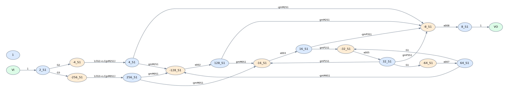

# Driving-Point Signal-Flow Graph Generator

Generate driving-point signal-flow graphs from compact circuit descriptions. The toolkit supports continuous-time filters, multiphase switched-capacitor circuits, and transistor-level circuits. A Python command-line interface builds the C++ engines, selects the appropriate engine, and produces graph data, plots, and analysis results.



## Quick start

Requirements: **Python 3.8+** and a **C++11 compiler** (`g++` by default). Graphviz's `dot` executable is optional; the plotting tool uses Matplotlib when Graphviz is unavailable.

From this directory:

```bash
python3 -m venv .venv
source .venv/bin/activate
python -m pip install -r requirements.txt
python sfg.py 5T_OTA_Integrator_tran
```

The wrapper compiles the selected engine on first use and prints the output directory. Open `report.html` in that directory to browse the graph and edge expressions. Each run gets a separate timestamped directory under `runs/`.

**Run any bundled example by name:**

```bash
python sfg.py Sallen_Key
python sfg.py FirstOrderSCFilter
python sfg.py 2Stage_OTA
python sfg.py --list-examples
```

**Run your own circuit:**

```bash
python sfg.py /path/to/my_circuit.isc
```

## Graphs, paths, loops, and transfer functions

```bash
# Graph data, PNG/SVG plots, and an HTML report
python sfg.py 5T_OTA_Integrator_tran

# Graph plus forward paths, cycles, and symbolic path/cycle products
python sfg.py FirstOrderSCFilter --mode analysis

# Enumerate only forward paths or only cycles
python sfg.py Sallen_Key --mode paths
python sfg.py Sallen_Key --mode loops

# Select the original C++ path/loop routines
python sfg.py FirstOrderSCFilter --mode analysis --analysis-backend legacy

# Invoke the original C++ symbolic numerator/denominator routines
python sfg.py 1stRCLPF --mode transfer

# Choose a new output folder
python sfg.py 2Stage_OTA --mode analysis --output runs/my_ota

# Generate graph data without installing Python plotting packages
python sfg.py 5T_OTA_Integrator_tran --no-plot
```

`graph` is the default mode. `paths`, `loops`, and `analysis` use Python graph analysis by default. `transfer` invokes the original C++ analysis and symbolic transfer-function routines. See [commands and outputs](docs/usage.md) for all options.

## Browse the examples

The package contains **17 circuit examples** with generated results:

- [Example catalog](examples/README.md)
- [Graph gallery](results/graphs/index.html)
- [Python path/loop analysis gallery](results/analysis/index.html)
- [Original C++ analysis results](results/legacy_analysis/index.html)
- [Transfer-function examples](results/transfer/README.md)

Download the repository and open the HTML files locally to view the reports. The PNG and SVG images can also be viewed directly on GitHub.

```bash
# Generate the complete gallery in a fresh timestamped directory
python run_examples.py

# Run all examples with Python path/loop analysis
python run_examples.py --mode analysis
```

## Directory layout

```text
.
├── sfg.py                  # Unified command-line wrapper; automatic compilation
├── analyze_graph.py        # Python path/cycle analysis, preserving parallel edges
├── plot_graph.py           # PNG/SVG/DOT rendering and HTML reports
├── run_examples.py         # Batch example runner and gallery index
├── requirements.txt
├── src/
│   ├── driver.cpp          # Filename/mode adapter and structured graph exports
│   └── legacy/             # Original C++ source snapshots and design notes
├── examples/
│   ├── continuous_time/
│   ├── switched_capacitor/
│   ├── transistor/
│   └── experimental/
├── docs/                   # Usage, input format, architecture, source checksums
├── results/                # Included example runs, images, and analysis data
├── tests/                  # Package and integration tests
├── build/                  # Locally compiled engines; ignored by Git
└── runs/                   # Your generated runs; ignored by Git
```

## Documentation

- [Command reference and output files](docs/usage.md)
- [Circuit input format](docs/input-format.md)
- [Implementation and engine selection](docs/architecture.md)
- [Original source snapshots](src/legacy/README.md)

## Development

```bash
python -m unittest discover -s tests -v
```

The original C++ sources and circuit examples are preserved byte-for-byte. The package adds input handling, engine selection, structured exports, Python graph analysis, visualization, and per-run output management around them.
